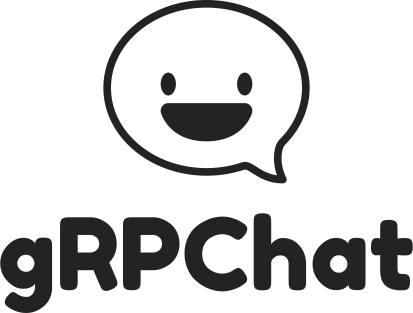

<h1 align="center">
  
  <p align="center" style="font-size: 0.5em">Chat based on gRPC</p>
</h1>

Project `grpchat` - simple server/client chat based on gRPC, Redis,
Protocol Buffers with golang for server side and Vue, Typescript, gRPC-web, Stylus and Cypress for client side.
Feel free to try [demo](https://enfipy.github.io/grpchat/)

## Usage:

To begin development:

```
docker-compose up --build
```

## Project:

Project structure:

```
.
├── schema/ - proto files + generated code by protoc
├── envoy/ - envoy proxy config + dockerfile
├── client/ - vue frontend
└── server/ - go backend
```

## Todo:

1. Add authentication through `Github OAuth2`
2. Add chats/groups

## Links:

Read about protobuf [here](https://developers.google.com/protocol-buffers/)

What is [gRPC](https://grpc.io)?
